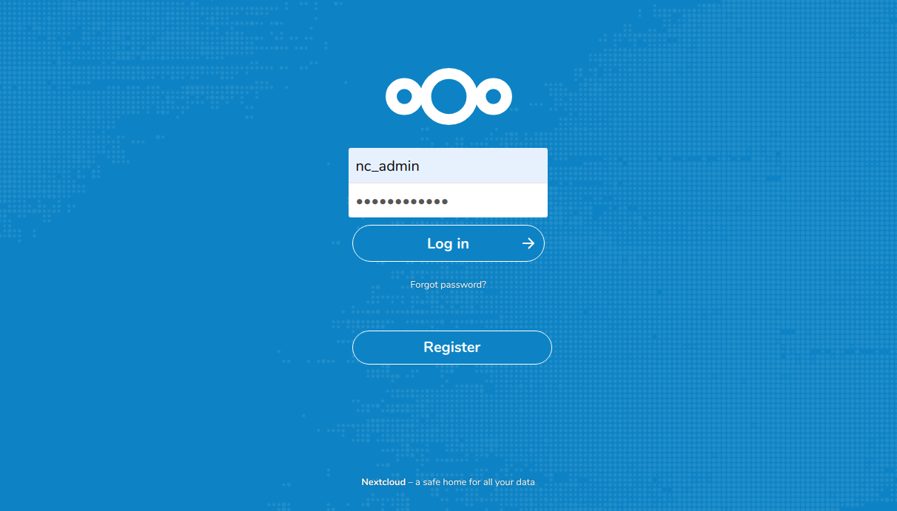
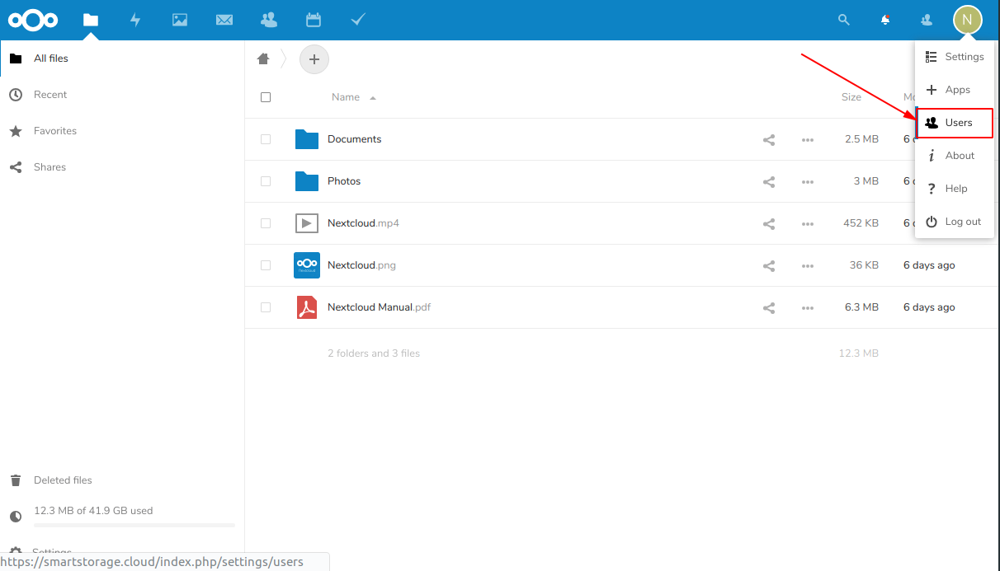
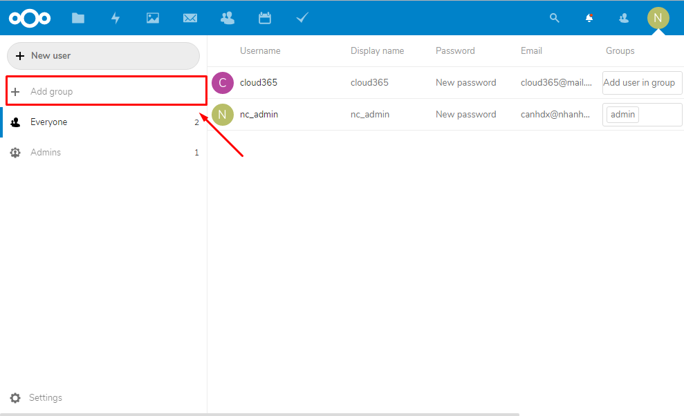
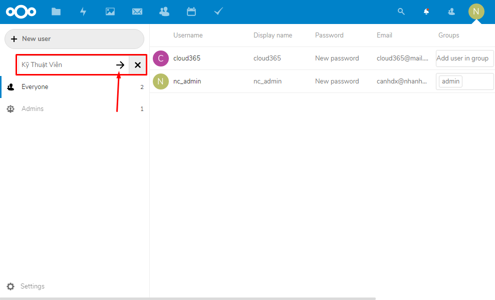
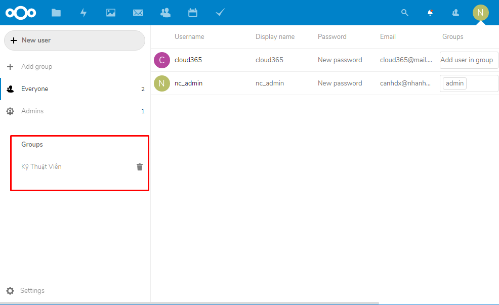
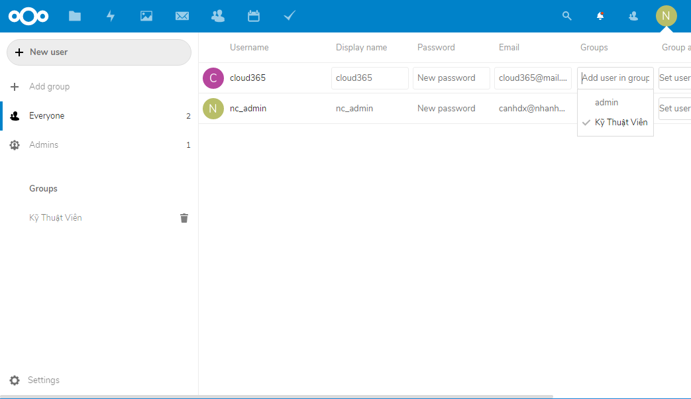
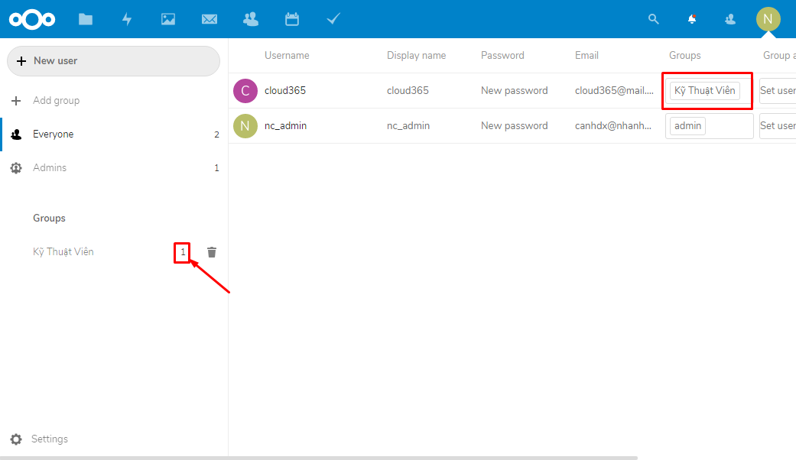

## Mở đầu

Nextcloud cũng cung cấp cho bạn tính năng quản lý người dùng theo nhóm tùy vào mục đích sử dụng. Ví dụ trong một doanh nghiệp có rất nhiều phòng ban, bạn cần phải giới hạn quyền truy cập file chỉ một số bộ phận có thể được xem hoặc chỉnh sửa chẳng hạn.

Bạn có thể tạo ra các nhóm người dùng khác nhau cho các phòng ban khác nhau, và bổ sung những User vào các phòng ban đó. 

> Một user có thể thuộc nhiều Group

## Tạo Group

Đăng nhập vào tài khoản **Admin** của NextCloud

Truy cập đến màn quản trị Users tại góc trên bên phải

Sau đó chọn **Add group** để tạo mới group

Nhập tên Group sau đó chọn **➡** 

Tạo mới thành công

## Thêm User vào Group

Để thêm User vào group, cũng tại màn quản trị Users, chọn User cần thêm sau đó chọn Group.

> Một user có thể thuộc nhiều Group

Thêm thành công

## Tổng kết

Bạn có thể lặp lại các quy trình tạo Group, hoặc thêm User vào một Group như ở trên để phù hợp với doanh nghiệp và mục đích sử dụng của bạn. 

Cảm ơn các bạn đã theo dõi bài viết và chúc các bạn thực hiện thành công.

---

Thực hiện bởi <a href="https://cloud365.vn/" target="_blank">cloud365.vn</a>
