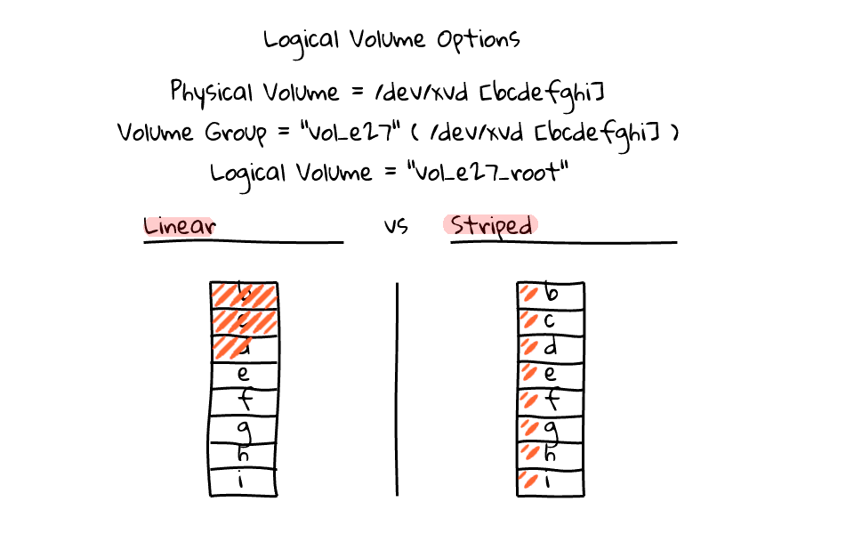

## Lời mở đầu
Ở bài trước chúng ta đã cùng nhau tìm hiểu về công nghệ LVM là như thế nào. Vậy ở một disk sẽ lưu trữ dữ liệu ra sao và kiểu lưu dữ liệu nào sẽ là tối ưu. Ở bài này tôi sẽ giới thiệu cho bạn biết hai kiểu lưu trữ trong disk là linear và striped 

## Phân biệt hai kiểu lưu trữ 
Mô hình hai kiểu lưu trữ 

Khi ta lưu trữ ổ dữ liệu vào ổ đĩa thì ta sẽ có hai kiểu lưu trữ như trên đó là linear và striped. Giả sử ta có các phân vùng từ b tới i như trên thì các kiểu lưu trữ sẽ được lưu trữ như sau 
- Linear : Dữ liệu sẽ được lưu hết phân vùng này rồi bắt đầu chuyển sang phân vùng khác để lưu trữ
- Striped: sẽ chia đều các dữ liệu ra và ghi vào các phân vùng đã có. Và cách chia dữ liệu ra bao nhiêu thì được định sẵn bởi người cài đặt nó

## Ưu điểm và nhược điểm của hai kiểu lưu trữ
**Linear**
- Ưu điểm : Các dữ liệu tập trung vào một phân vùng sẽ dễ dàng quản lý
- Nhược điểm : Khi bị mất dữ liệu sẽ mất hết dữ liệu của một phần đó. Làm việc chậm hơn bởi vì chỉ có một phân vùng mà trong khi các khu vừng khác không hoạt động

**Striped**
- Ưu điểm: Tốc độ sẽ nhanh hơn vì tất cả các phân vùng sẽ cùng làm việc. Tốc độ đọc và ghi cũng nhannh hơn phương pháp Linear
- Nhược điểm: Khi mất dữ liệu ở một phân vùng thì sẽ bị mất và ảnh hưởng rất nhiều dữ liệu bởi vì mỗi dữ liệu đều được lưu ở nhiều phân vùng khi sử dụng phương pháp striped

## Kịch bản và chuẩn bị
Để có thể hiểu rõ hơn về hai cách lưu trữ và kiểm tra kết quả thì tôi sẽ thực hiện một bài lab để giúp các bạn nhìn rõ hơn về nó. Đầu tiên tôi sẽ tạo ra một VM gồm 3 disk. Sau đó tạo ra 2 logical có 2 kiểu lưu trữ là linear và striped rồi sau đó thực hiện quá trình kiểm tra và giám sát sự đọc ghi của các logical. Ta phải chuẩn bị VM như sau
- 3 disk 
- Cài các gói sau : wget, bwn-ng 

## Thực hiện
Đầu tiên ta cài gói wget cho VM 
