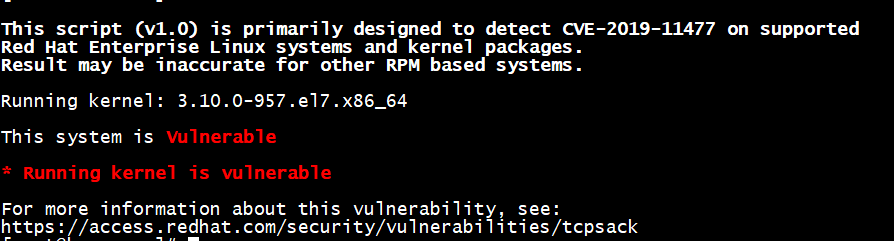
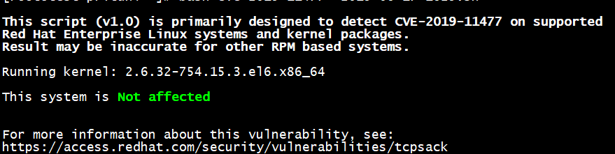

Ngày 17/6/2019, 3 lỗ hổng liên quan đến việc xử lý các gói tin TCP đã được tìm thấy trong Linux kernel. 

Lỗ hổng nghiêm trọng nhất có thể cho phép kẻ tấn công từ xa gửi mã khai thác và gây ra crash hệ thống, ảnh hưởng đến tính khả dụng của các dịch vụ của hệ thống.
Không có sự leo thang đặc quyền hoặc rò rỉ thông tin.

## Các lỗ hổng này bao gồm:

- CVE-2019-11477 (có mức độ nghiêm trọng).
- CVE-2019-11478.
- CVE-2019-11479.

## Phạm vi ảnh hưởng:

- Các phiên bản Linux Kernel trước ngày 17/6

## Cách kiểm tra hệ thống tồn tại lỗ hổng:

- Download script ở địa chỉ:
https://access.redhat.com/sites/default/files/cve-2019-11477--2019-06-17-1629.sh

```sh
wget https://access.redhat.com/sites/default/files/cve-2019-11477--2019-06-17-1629.sh 
bash cve-2019-11477--2019-06-17-1629.sh
```

- Kết quả hệ thống tồn tại lỗ hổng:



- Kết quả hệ thống không tồn tại lỗ hổng:



## Biện pháp xử lý

Khuyến cáo người dùng sớm Update Kernel lên phiên bản mới 
Sau đó thực hiện 1 trong 2 cách fix sau:
- Disable SACK processing (/proc/sys/net/ipv4/tcp_sack set to 0).
    ```sh
    echo 0 > /proc/sys/net/ipv4/tcp_sack
    ```
    Hoặc
    ```sh
    sysctl -w net.ipv4.tcp_sack=0
    ```
- Add rules vào firewall:
    ```sh
    firewall-cmd --permanent --direct --add-rule ipv4 filter INPUT 0 -p tcp --tcp-flags SYN SYN -m tcpmss --mss 1:500 -j DROP
    firewall-cmd --permanent --direct --add-rule ipv6 filter INPUT 0 -p tcp --tcp-flags SYN SYN -m tcpmss --mss 1:500 -j DROP
    firewall-cmd --reload
    firewall-cmd --permanent --direct --get-all-rules
    ```

    Hoặc đối với iptables:
    
    ```sh
    iptables -I INPUT -p tcp --tcp-flags SYN SYN -m tcpmss --mss 1:500 -j DROP
    ip6tables -I INPUT -p tcp --tcp-flags SYN SYN -m tcpmss --mss 1:500 -j DROP
    iptables -nL -v
    ip6tables -nL -v
    ```

**Link tham khảo:** 
- https://access.redhat.com/security/vulnerabilities/tcpsack

---
Thực hiện bởi <a href="https://cloud365.vn/" target="_blank">cloud365.vn</a>
